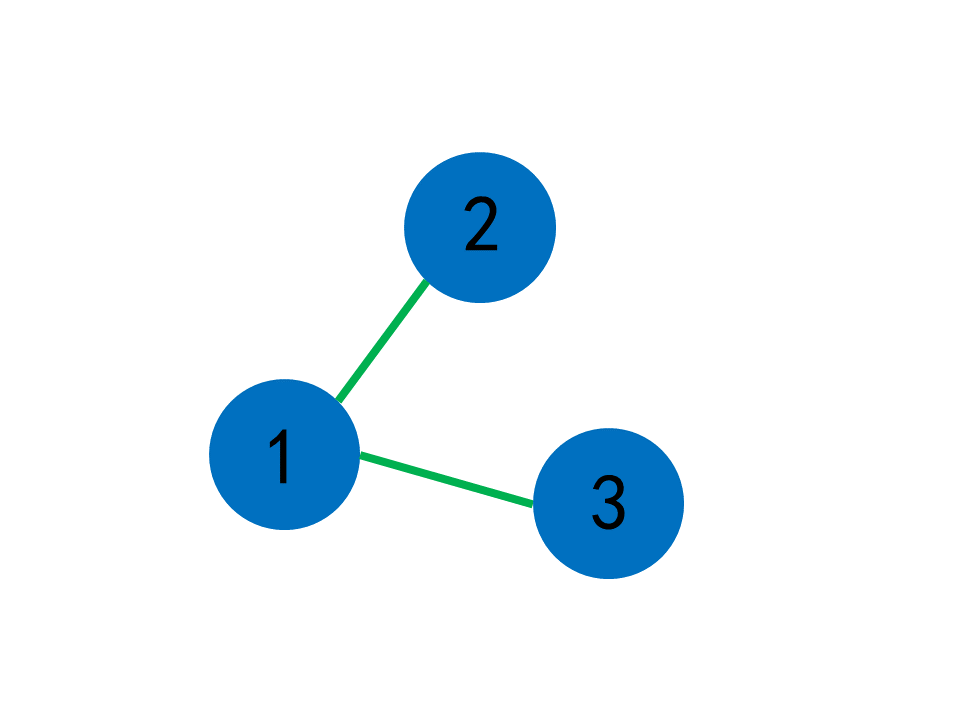
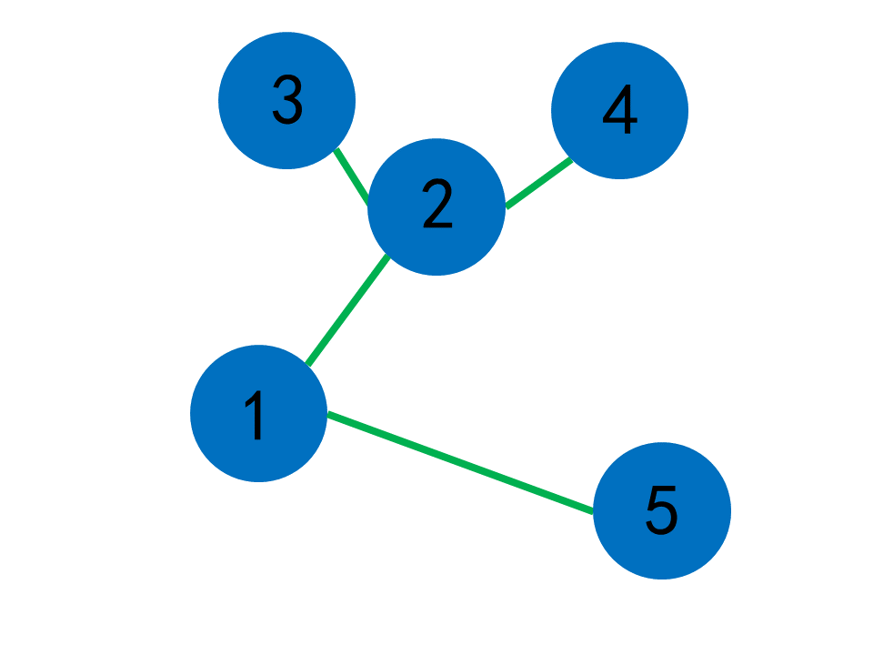

# 长河乱语 二

OTTF 2023 8 13 起写

OTTF 2024 2 2 终写

## 第0章 引子

日刚落，何乐乌领着沃柔德坐在石凳上，把自己的板子“啪”的一声摆在石桌中央：“一周过去了呢。是时候了呢！”

“是啊，”沃柔德喘了喘气，“不过……你也不用跑着过来。”

“那么”，何乐乌扬扬眉毛，“我们承接上一次的话题——也不是太‘承接’——让我们从一个故事开始。”

## 第1章 汉诺塔

> 您是不是要找：递归
>
> ——在谷歌上搜索“递归”

传说——注意，传说，具体是谁编出来的呢？你猜——传说，在一片深绿的森林里，居住着一位仙灵，她的名字叫做“汉斯·达拉崩吧·伊达利亚·亚历山大·茉莉·诺”。不过当然，连她自己也不愿总是重复这名字，所以，我们可以叫她“汉诺”

汉诺拥有强大的法力，她不仅有合并两块石头的惊人力量，还有从树上摘取苹果的强大能力。不仅如此，有一天她十分的闲，就造了个玩具给河边一名叫做“鲁·约瑟·夫·站成一圈·班”的木匠玩，这个玩具是这样的：

在一个底座上，竖立着三个小棍子，我们称他们为“棍子一”“棍子二”“棍子三”。棍子一被套上了$n$个在圆形有孔的圆盘，圆盘大小不一，但半径是等差的，并且它们大的在下面，小的在上面。$n$等于$2$的场景的正视图大抵如此：

``` 字符艺术
 *|*    |     |
**|**   |     |
ooooooooooooooooo
ooooooooooooooooo
```

而现在，我们需要把所有圆盘从棍子一挪到棍子三。很简单是吗？但是我们有一些限制条件——一次只能挪动$1$个盘子，并且任何时刻，一根棍子上的小盘子都不能在大盘子的上面。

$n$等于$2$的时候，我们好像很容易完成任务，那$n$再大一点呢？我们该如何做呢？有一个不变的法则指导我们吗？

还记得我们上次谈到的“递归”吗？当我们解决一个大问题时，可以尝试缩减它的规模，而且一般是在数字上做文章。当然，我们还需要指定一个递归的停止条件。既然这样，我们不妨设立`汉诺塔（一个数n）`这个函数，让它输出移动方针。而显然，当`n`等于`1`时，我们可以直接把那仅有的一个盘子从棍子一挪到棍子三。

``` 伪代码
汉诺塔（一个数n）：
    如果n等于1：
        输出 “把盘子从棍子一挪到棍子三”
```

我说的`输出`指的是用各种方法把数据表示出来，比如最简单的——显示在电脑屏幕弹出的黑框框里。注意，输出的内容不包含引号。在这里，引号的作用是“嘿，电脑快看，我打算把括号里面的内容作为一段‘字符串’”，“字符串”顾名思义，是由一些字符组成的串串。

既然我们想出了`n`等于`1`时的情况，我们就可以继续延伸。来想想，当我们能解决`n`为`a-1`的情况时，如何解决`n`为`a`呢？比如说，如果我们能解决`n`为`9`或者更小的数——比如`1`——的问题，我们该如何解决`n`为`10`的呢？

想啊，想啊。其实，走到这一步，我们已经很聪明了。所以，我们到底怎么解决呢？啊哈！用`n`为更小的数的操作，来一下下完成我们想要完成的操作就可以了。好吧，一堆胡话。嗯哼？嗯。

显然的，`10`只比`9`大`1`，而`9`与`1`都小于`10`，这可以帮助我们解决问题吗？比如设想一个方案：先把上面`9`个盘子从棍子一挪到棍子二——在设想中，我们能通过每次移动$1$个盘子的复杂步骤解决这个问题，我们就在这里递归下去；再把剩下的`1`个盘子从棍子一挪到棍子三；最后把那`9`个盘子从棍子二挪到棍子三，好像就能完成任务。

是否正确呢？这方案是否可行呢？我们的盘子移动有一定限制，我们显然每次只会移动$1$个盘子，那会不会有大盘子在小盘子上面呢？来细细看：首先，“先把上面`9`个盘子从棍子一挪到棍子二”，由于剩下的那个最大的盘子一直待在原地，没有别的干扰，所以这步正确；下一步只是移动一下剩下的那个最大的盘子，所以也不错；最后的部分，“把那`9`个盘子从棍子二挪到棍子三”，由于剩下的盘子待在棍子三，也不会干扰，所以这步也正确。也就是说，我们解决了这个问题。而显然，这步骤可以推广到所有情况，我们甚至能写一个伪代码。

当然，在伪代码中，我们除了添加东西，还要最一些修改：每一次，我们都会有“把一些盘子从这个棍子挪到那个棍子”的需求，所以这两个棍子最好给出，同时，剩下的那个棍子作为辅助，也需要给出。所以：

``` 伪代码
汉诺塔（一个数n，一个字符串，是起点棍子，一个字符串，是终点棍子，一个字符串，是辅助棍子）：
    如果n等于1：
        输出 “把盘子从”起点棍子“挪到”终点棍子
    否则：
        汉诺塔（n-1，起点棍子，辅助棍子，终点棍子）
        汉诺塔（1，起点棍子，终点棍子，辅助棍子）
        汉诺塔（n-1，辅助棍子，终点棍子，起点棍子）
```

我们就此获得了汉诺塔问题的通用解决方针，好耶！但是，如果鲁·约瑟·夫·站成一圈·班想要知道对于一个$n$，它需要用几次移动才能把$n$个盘子从棍子一挪到棍子三，那我们应该如何计算呢？

让我们用$次数(n)$代表把$n$个盘子从棍子一挪到棍子三所需的移动次数，显然$次数(n)=1$。继续下去，$次数(2)=次数(1)+次数(1)+次数(1)=3$，$次数(3)=次数(2)+次数(1)+次数(2)=7$。发现了吗？我们每一次计算$次数(n)$都会用到$次数(n-1)$，具体来说，$次数(n)=2\times次数(n-1)+1$。

看上去我们可以用一个递推来解决问题，但我们还有更简便的方法。注意到——这是一个著名的短语——$2^n$的计算方法与此相近：$2^n=2\times2^{n-1}$，让我们来思考以下它们的关系：

显然可见$次数(1)=1=2^0$，但一个$1$一个$0$不太方便，所以我们换一种方式——$次数(1)=1=2^1-1$，那么显然$次数(2)=2\times次数(1)+1=2\times(2^1-1)+1=2^2-2+1=2^2-1$，嗯？有好看的！$次数(1)=2^1-1$，而相应的，$次数(2)=2^2-1$！左边的参数是右边的指数，而变化的只有它！接着计算$n=3,4,5$，也是一样的，你大可自己想想——嗯。

这是因为当我们把$次数(n-1)$乘$2$时，它的$-1$变为$-2$，而外面正好有一个$+1$，也就又变成$-1$。所以，$次数(n)=2^n-1$，真美妙。

汉斯·达拉崩吧·伊达利亚·亚历山大·茉莉·诺也觉得这太美妙了，于是乘着摆渡车把汉诺塔散播在世间，让我可以做这个开头。

## 第2章 迷宫

> 其实世界上本没有图，思考的人多了，也便有了图。
>
> ——自鲁迅《故乡》中的名句魔改而来

这世间有千千万万个游乐园，而有的游乐园里有迷宫，有的则没有，还有些迷宫可能不在游乐园而是在公园里。不管怎么样，让我们思考一个问题——对于一个有起点和终点的迷宫，怎么从起点走到终点。

说到这个问题，你可能有了一个想法——确实，你可能听说过，只要从迷宫的起点开始，一直用左手摸着左边的墙壁走下去，就可以到达终点。

但是，我们怎么知道这是不是正确的呢？如果你某一天进了个迷宫，然后按这种方法行走，最后困在了里面，那肯定是不好的。所以，我们应该如何判断它是否正确呢？“迷宫”这种东西是很具体的，让我们来尝试对它做一些抽象——

我们把一个岔路口看作一个“节点”，然后把一条笔直的路看作一条“线段”，于是，我们可以创造出这样一个“迷宫”：



可以看见，我把每个节点画得实际上像一个圆，并且还标上了数字，这是因为我们十分关心点。为了方便，我们把每个节点的数字称为“编号”，并且暂且认为在每个节点中，编号最小的代表迷宫的入口，编号最大的则代表迷宫的出口。

很好！现在想象一下，你正站在迷宫的入口——节点1，在你眼前的有两条路，左边的一条通往节点2，右边的一条通往节点3。于是，你用左手摸着墙壁，朝左边的那条路走去。

走到尽头，这条路是条死路！你继续秉承着左手摸墙的信念，在道路的最末端掉头，于是你回到了节点1。然后，继续摸着墙壁，你走向右边的道路。最终，皆大欢喜！你走到了节点3，也就是出口！

这是一种非常简单的迷宫，简单到连三岁小孩都能理解。现在，让我们来考虑一种更复杂的情况：



还是想象一下：首先从节点1到节点2，然后先走到节点3，死路，回到节点2。再走到节点4，也是死路，回到节点2。

这时怎么办呢？节点2走向的两个节点都是死路，也就是说，节点2已经被我们完全查看过，到不了出口了。那么，我们就应该回到节点1。回到节点1后，我们来到节点5，是出口。

这样看来，这条左手摸墙的策略应该是正确的，我们总能到达出口，但现在，让我们再来审视一下刚才行走的过程：

对于每个节点，如果它并不是出口，我们就应该探索它能“通往”的每一个节点。比如我们从节点2来到节点3。而当我们到过这个节点“通往”的每一个节点后，我们就应该回到“通往”这个节点的那个节点。比如我们在探索完节点2能通往的节点——节点3和节点4——后，回到节点1。更简练的，我们“探索”到“死路”，然后“回溯”到“之前”。

诶！我们实际上已经悄悄转换了我们的行动规则。我们原先使用左手摸着墙壁，现在却是“‘探索’到‘死路’，‘回溯’到‘之前’”。显然，我们的新规则更抽象化，虽然可能不利于人类使用，但却像是一种更适合计算机的算法。

那它们之间有什么不同吗？来看这个：


考虑一下从节点2之后的场景：当使用老规则时，我们顺着左边的墙转了一圈，又从2节点出来；而对于新规则，在到达节点4时，由于我们到达过节点2，所以节点4已经的路已经没有一条可以走下去了，于是我们开始“回溯”，回溯到节点2。

所以，我们的新规则建立在“访问记录”之上。“访问记录”，听听，多炫酷的名词！出自我口。当我们到达——或者说，访问——某个节点时，我们应该记下来，“我到过这里！”，这样，除非是回溯过来，我们就不会再来到这里了。

实际上，在一开始，我们就一直在做“访问记录”，只是我把它刻意隐藏了。比如说，在我们从节点1来到节点2后，我们不会“嗖”地一下再冲进节点1，这是因为我们知道我们就是从节点1来的，而显然，这也是“访问记录”。

我们的这种走迷宫方法实际上有很多高雅的名字，首先是“回溯法”，这是因为我们“探索”到“死路”，然后“回溯”到“之前”。还有一个是“深度优先搜索”，“深度优先”指的是我们会一条路走到又黑又深，并且越深越好。“搜索”指的是我们走迷宫的方法就是在搜索出口的位置。事实上，“搜索”是一类精妙算法的总称，在搜索算法中，我们一般会寻找某个问题的解。比如在迷宫中，我们寻找走出迷宫的方案。

说了这么多，让我来展示一下深度优先搜索走迷宫的伪代码：

``` 伪代码
深度优先搜索走迷宫（当前走到的节点point）：
    如果point是出口：
        好耶！走出去！结束整个程序！
    对于point能到达的每个节点pointI：
        如果pointI没有被访问过：
            深度优先搜索走迷宫（pointI）
```

“回溯”在哪里呢？你看，如果能到的节点都被访问过了，这一个节点的这层函数调用就会结束，程序也就回到过来的那个节点，也就是“回溯”，此乃递归奥妙之一。顺便，你可能会发现这里的伪代码与之前的有所不同——我没有再写什么数组了，这是因为我们这一次讨论的问题比较——呃——奇怪，如果我把什么东西都用比较基本的数据结构表示出来，就会比较繁琐。

有“深度优先搜索”，那有别的什么“搜索”吗？来，还是这个迷宫：


现在请想象你是一只可以自由变形的奇特生物，为了走出迷宫，你打算让身体扩展下去，直到碰见了出口。

也就是说，你的身体将会一层一层扩展，从而接触各个节点。一开始，你的身体只接触了节点1，而在你向外扩展一次后，由于节点1跟节点2和节点5相连，你的身体就也接触了节点2与节点5，而节点5正好是出口。

这样看起来，这种“自由变形的奇特生物”策略好想要比“深度优先搜索”更快一些——我们只扩展一次就找到了终点。而正如我刚刚说的，这种策略也是一种搜索，它叫做“广度优先搜索”，因为我们会一步步进行扩展，从而让涉及到的节点尽可能广。

广度优先搜索也可以用代码实现，但是——这需要用到一点儿奇怪的知识，我们先按下不表。或者说——你可以自己思考一下？欸嘿。

顺带一提，这两种搜索方式各有一个简称，分别是“深搜”和“广搜”。

## 第3章 皇后

> 可看见那蛮横的暴君
>
> 正举起那血色的旗！
>
> ——选自鲁热·德·利尔创作的《马赛曲》，自译版本，按个人喜好作了改动

国际象棋是一种棋类游戏，棋盘上的在方格中，有多种多样的棋子供人使用，其中“皇后”是比较强大的，它可以走到到与它在同一行、同一列、同一斜线的敌方棋子之位置并将其吃掉，不过当然不能跨过其它棋子。比如说：

``` 字符艺术
 - - - -
| |A| |E|
 - - - -
|C|Q| | |
 - - - -
| |B|D| |
 - - - -
| | | |F|
 - - - -
```

作为皇后，棋子“Q”就可以攻击到与之在同一行的“C”、与之在同一列的“A”“B”、与之在同一斜线的“E”，但不能攻击到“F”，因为它们之间隔了别的棋子。

在闲暇之余，人们也就有了一个疑问：对于一个$N \times N$的棋盘，在其中放$N$个皇后而不放其它棋子，且让每一个皇后都不能攻击别的皇后的可能有多少呢？先让我们来看看对于$4 \times 4$棋盘的一种情况：

``` 字符艺术
 - - - -
| |Q| | |
 - - - -
| | | |Q|
 - - - -
|Q| | | |
 - - - -
| | |Q| |
 - - - -
```

显而易见，这其中的任意两个皇后都不能在同一列、同一行、或同一斜线。而上面那个就是一种可能的情况。现在，让我们来想一想如何解决这个问题。

可以用深度优先搜索试试，因为这时，我们就是在寻找这“皇后问题”的解。由于一行只可能有一个皇后，我们可以在每一行中枚举这个皇后的位置，并且判断此位置是否可行。当每一行的位置都被确定时，这时一种方案，我们可以计数。

``` 伪代码
棋盘大小n
方案数res
皇后问题（到达的行数now）：
    如果now>n：
        res为res+1
        返回
    对于第now行的每一个位置place：
        如果place可以放置皇后：
            放在place
            皇后问题（now+1）
```

啊哈，看起来不错，我们使用深度优先搜索解决了这个问题。不过，所谓`如果place可以放置皇后`好像有点笼统，让我们细细分析一下。

由于我们已经让每一行有且只有一个皇后，所以`如果place可以放置皇后`指的是“没有皇后与这一位置在同一列或同一斜线”，而“斜线”实际上指的是“从左上到右下的斜线”（“\”——作者按）或“从右上到左下的斜线”（“/”——作者按）。那么，先让我们想想，该怎么知道某一列有没有皇后呢？

只需要开一个数组，让其大小等于列数就好了。如果我们在某一列的一个位置放了一个皇后，我们就在数组对应的位置打上“标记”。有很多打“标记”的方法，只要让有“标记”的地方与无“标记”的地方有差别就可以了。比如说，一开始数组里的每一项都是奇数，而打了标记就会变成偶数；或者说，一开始数组里的每一项都是整数，而打了标记就会变成小数；在或者说，一开始数组里的每一项都是0，而打了标记就会变成1……

我们使用一种与最后一种类似的方法——一开始数组里的每一项都是“假”，打了标记就会变成“真”。“假”和“真”，英文里称为“false”和“true”，为了纪念布尔这位聪明的科学家而被统称为“布尔值”，它是十分重要的概念，可以帮助你在互联网上指点江山。但实际上，它们非常好理解——在这个例子里，你可以认为“假”代表“‘这列有皇后’是假的”，而“真”代表“‘这列有皇后’是真的”。

所以说，我们的伪代码可以被细化为：

``` 伪代码
棋盘大小n
方案数res
一列数judge，有n个数
皇后问题（到达的行数now）：
    如果now>n：
        res为res+1
        返回
    对于第now行的每一个位置place：
        如果 judge[place]的反 且 与place处于同一斜线的位置无皇后：
            放在place
            judge[place]为真
            皇后问题（now+1）
```

稍等，`judge[place]`的意思是很清楚的，那`judge[place]的反`呢？事实上，我们在一个布尔值的旁边加上一个符号，表示取相反的值，比如说，`真的反`就是`假`，而`假的反`就是`真`。或许你可以把这其中的“反”理解为“相反的值”。

而对于`且`，相信你并不陌生——它就是表示“两个值都是`真`，最终才是`真`”。比如，如果我们写道`1等于1 且 2等于2`，那就是`真`，而`1等于1 且 2等于200`、`1等于100 且 2等于2`、`1等于100 且 2等于200`则都是`假`。与之类似的还有`或`，它是指“两个值只要有一个是`真`，最终就是`真`，当然两个也可以”，比如说除了`1等于1 或 2等于2`是`真`外，`1等于1 或 2等于200`、`1等于100 或 2等于2`也是`真`，而只有`1等于100 且 2等于200`是`假`。

显然，我们应该处理对同一斜线的判断，让`与place处于同一斜线的位置无皇后`更具体了，那么该怎么做呢？注意，如果我们有这个棋盘：

``` 字符艺术
 - - - -
|4|3|2|1|
 - - - -
|5|4|3|2|
 - - - -
|6|5|4|3|
 - - - -
|7|6|5|4|
 - - - -
```

太方便了，它为所有从左上到右下的斜线编了号，这样看来，我们可以把处理同一列的思路套用到处理斜线上——也开数组。不过我们迫切地需要解决一个问题——对于一个格子，怎么知道它是在第几个斜线呢？

就拿从左上到右下的斜线来说吧，注意到，第$1$行第$4$个格子——不如称它为，格子$(1,4)$——位于第$1$个斜线，而格子$(1,3)$和格子$(2,4)$都位于第$2$个斜线。继续下去，我们整理到：

斜线$1$：格子$(1,4)$；

斜线$2$：格子$(1,3)$、格子$(2,4)$；

斜线$3$：格子$(1,2)$、格子$(2,3)$、格子$(3,4)$；

斜线$4$：格子$(1,1)$、格子$(2,2)$、格子$(3,3)$、格子$(4,4)$；

斜线$5$：格子$(2,1)$、格子$(3,2)$、格子$(4,3)$；

斜线$6$：格子$(3,1)$、格子$(4,2)$；

斜线$7$：格子$(4,1)$。

可见对于斜线$i$，若其上的格子都形如$(x,y)$，那么$x-y$是一个定值，并且应该与$i$有关，具体而言：

若$i=1$，$x-y=-3$；

若$i=2$，$x-y=-2$；

若$i=3$，$x-y=-1$；

若$i=4$，$x-y=0$；

若$i=5$，$x-y=1$；

若$i=6$，$x-y=2$；

若$i=7$，$x-y=3$；

所以，可见$i-(x-y)=n$。换句话说，$(x,y)$这个格子，一定在第$n+x-y$条从左上到右下的斜线上。当然，我这里的“证明”过程完全不严谨，毕竟我只是列举了当$n=4$的所有情况。如果想的话，你可以自己试试比较严谨地进行推理。

相应的，对于从左下到右上的斜线，我们有：

``` 字符艺术
 - - - -
|1|2|3|4|
 - - - -
|2|3|4|5|
 - - - -
|3|4|5|6|
 - - - -
|4|5|6|7|
 - - - -
```

故而可发现，$(x,y)$这个格子，一定在第$x+y-1$条从左下到右上的斜线上。

至此，我们可以得到：

``` 伪代码
棋盘大小n
方案数res
一列数judge，有n个数
一列数judge1，有2*n个数
一列数judge2，有2*n个数
皇后问题（到达的行数now）：
    如果now>n：
        res为res+1
        返回
    对于第now行的每一个位置place：
        如果 judge[place]的反 且 judge1[n+now-place]的反 且 judge2[now+place-1]的反：
            放在place
            judge[place]为真
            judge1[n+now-place]为真
            judge2[now+place-1]为真
            皇后问题（now+1）
```

`judge1`是对从左上到右下的斜线的判断，而`judge2`是对从左下到右上的斜线的判断。它们都有`2*n`个数，是因为`n+now-place`与`now+place-1`都达不到`2*n`。

我们的皇后问题就到这里了——呼！真是个大工程！顺带一提，这个问题最的来源是“八皇后问题”，也就是当$n=8$时的情况，这是国际象棋选手马克斯·贝瑟尔提出的——一位国际象棋选手灵机一动，为学习算法的后人带来了一个大任务，真是有趣！

## 第4章 还是迷宫

> “请问‘Breadth First Search’能给我‘Bread’吗？”
>
> “给他三块面包，因为他想从算法中得到实际利益。”
>
> ——改编自欧几里得的故事

还记得我对广搜的讲解吗——在迷宫中，就像一个“可以自由变形的奇特生物”一样，一层层扩展自己的身体。在当时，我没有给出一个适当的伪代码。而在现在，我们看一个比较相似的问题——来，看这个“字符迷宫”：

``` 字符艺术
oooo-
o*ooo
+****
ooooo
ooooo
```

在此处，“o”代表空地，就是只有平坦的地面。“*”是障碍物，人不能踩上去，更不可能越过去。而“+”和“-”分别代表起点和终点。我们的任务是从起点开始，走到终点。

显然，我们可以用深搜来解决这个问题，但是，我们不妨借此机会，来看看广搜。记得吗？我在引出广搜时曾提到广搜比深搜快一点点，这是偶然吗？不是。回想到，深搜会一直在一条路下扩展，如果这条路很长而且不是正路，那我们就会白白浪费很多时间，比如上面这个例子，使用深搜就有可能在“+”下方兜一个无用的大圈子，但广搜会一层一层扩展，就不会有这个问题。

那就来用广搜解决这个问题吧！我们还是把自己想象成一个“可以自由变形的奇特生物”，一开始，我们站在起点。然后，每一次我们都到达一个“能到达”且“还没到达过”的地方，将“身体”延展到那里。而当我们的身体抵达终点时，就可以结束了。

还有一个问题——我们怎么表示迷宫中的一个位置呢？显然，我们可以用两个数字——第几行和第几列。比如说，在这里，起点可以用“第3行第1列”表示。而我们可以写出这样的伪代码：

``` 伪代码
一个位置p，行为3，列为1
```

而显然，我们可以对行列做简单的加减，从而得到一个位置的相邻位置。“第3行第1列”上边的位置就是“第2行第1列”。

那么，我们该怎么存储这个迷宫呢？联想到我们的数组，可以发现，所谓“数组”也可以被认为是一种“元素”，那么也就可以有“由数组构成的数组”：

``` 伪代码
一列元素map，其中的每一个元素是一列字符
```

接下来，再来一个问题——怎么写出广搜呢？对于深搜，我们可以用递归的方式实现，但广搜呢？注意到，我们处理的实际是一个个位置——或者说得普遍一点——一个个“状态”。而我们以“层”把这些状态分开，就像刚才的迷宫：

``` 字符艺术
34567
2*678
1****
23456
34567
```

原先起点的位置被我标成1，剩下的位置中，除了障碍，也都被我标上了“层数”。看起来，我们可以把这些状态按照层数分类。而每一次，对于最外的一层，我们再扩展一次，得到新的一层。所以，我们可以把这种做法表示为：

``` 伪代码
一列元素p，其中的每个元素是一列状态。p一开始有一个元素，里面有一个初始状态
重复执行：
    一列状态t
    对于p的最后一个元素中的每一个状态i：
        对于每一个i能扩展到且现在尚未扩展到的状态j：
            如果j是终点：
                退出
            t添加j
    p添加t
```

但是，我们对p的利用好像只是在做两件事情——访问它的最后一个元素中的每一个状态、将东西添加到它后面。换言之，只有p的最后一个元素中没有被扩展的状态是有用的。所以，不妨改造p，把它当成一个可以删除元素和在末尾添加元素的小工具。那么，我们可以写出：

``` 伪代码
一列状态p，一开始有一个初始状态
对于p中的每一个状态i：
    对于每一个i能扩展到且现在尚未扩展到的状态j：
        如果j是终点：
            退出
        p添加j
    p删除i
```

稍等！我们说过，在数列的末尾添加元素是$O(1)$的，但删除元素好像不是——它是$O(n)$的！我们有必要这么做吗？好吧，显然易见，我们每一次删除元素时，删除的都是数列最开头的元素。而实际上，有一种可以方便地在开头删除元素的“数据结构”，叫做“队列”，具体内容在且不谈，你可以认为我们删除`i`的操作是$O(1)$的。

那么，我们可以这样走迷宫：

``` 伪代码
迷宫（一列元素map，其中的每一个元素是一列有m个的字符，总共n个元素）：
    一列位置p，一开始有一个位置，是map中‘+’的位置
    一列数change1，有1、-1、0、0四个数
    一列数change2，有0、0、1、-1四个数

    对于p中的每一个位置i：
        对于change1中的每个数c1：
            对于change2中的每个数c2：
                一个位置new，其行为i的行+c1，列为i的列+c2
                如果0小于new的行小于等于n 且 0小于new的列小于m 且 没到过new：
                    如果new为map中‘-’的位置：
                        退出
                    p增加new
        p删除i
```

change1与change2分别表示在行方面和列方面的移动，而由于只能横平竖直地一步步行走，它们的数值被设定成上面的样子。

## 第5章 搜索技巧

> 技巧，技巧，技巧！
>
> ——《海绵宝宝》中的海绵宝宝

现在，让我们思考一个问题——怎么让搜索算法更快？

诶？刚刚不是讲到广搜要比深搜快的多吗？那我们还要深搜干什么？直接都用广搜不就好了？好吧，还记得我所说的“状态”吗？比如在字符迷宫的例子里，它指的就是我们当前的位置，而这只需要两个数字就可以表示，不会用多少空间。但是，如果现在我们是在迷宫中驾驶一台按钮十分多的超级机器人，而这些按钮各有各的作用——比如播放喜剧使我们的愉悦感加一，或者制作烤肉使我们的饥饿感减一，而我们需要考虑再走到终点的同时让自己的各项指标达到最优，那么一个状态除了包含我们的位置，还要包含各种各样的指标。而如果一个状态很大的话，把它们一个个放到队列里就不太明智了。

但是我们可以转变思路——既然正经的广搜有时不太明智，我们就可以试试不正经的。还是刚才的例子，注意到，对于处在一个状态的机器人，我们既可以让它往前、往后、往左、往右走，也可以去按那些奇奇怪怪的按钮。也就是说，从一个状态可以到达很多的“状态”。而这时，联想到“层”的概念，我们可以认为——扩展时，外层的状态数量大抵要比里面一层中的状态数量多得多，多到与最外层比起来，上面的几层中的状态少到大可忽略不计。

再或者说，当我们在深搜的时候，如果选中某一层状态，在这一层及其之上所花的时间是要远远小于在这一层下面所花的时间的——即使把前者乘2估计也没有什么变化——稍等，我们要干什么？

不卖关子了：我们进行多次深度优先搜索，但在每一次搜索前，划定一个“最大层数”，表示最多只搜索到这一层。这个数一开始是1，也就是只到最先的状态。每搜索完一次，如果找到了目标就到此为止，如果没有就把最大层数加一，然后再来一次搜索。这样，我们实际上也是在进行一层一层的扩展——每一次搜索只有“最大层数”那一层是新到的区域，而这一个区域足够大于老区域，所以重复经过老区域的时间相对而言比较小。这可以被认为是用深搜模拟广搜的方法，它的大名叫做“迭代加深”，我们可以这么表示他：

``` 伪代码
最大层数maxDep，一开始为1
是否找到要找的东西flag，一开始为假

深搜（当前状态now，当前层数nowDep）：
    如果nowDep大于maxDep：
        退出
    如果now是要找的：
        flag为真
        退出
    对于每一个now能走到且没到过的状态new：
        深搜（new，nowDep+1）

重复执行：
    深搜（初始状态，1）
    如果flag：
        退出
    maxDep为maxDep+1
```

接下来，我们再来看另一种加快搜索的方式——使用估价函数。什么是估价函数呢？我们回到简单的迷宫例子。

``` 字符艺术
oooo-
a*ooo
+****
boooo
ooooo
```

加号是起点，减号是终点。从加号出发，我们一看就知道走到`a`肯定比走到`b`更优，但计算机不知道，所以我们要让它知道。想一想，我们是怎么“一看就知道”的呢？大概是因为我们比较了`a`与`b`两个位置各自与减号之间的“距离”——由于`a`在直觉上离终点更近，人类更有可能会往那里走。

不过，这种粗略的判断方式有时是错误的，比如：

``` 字符艺术
o*oo-
a*ooo
+**oo
boooo
ooooo
```

这个时候，我们就应当走向`b`。因此，这种判断方式可以被作为是一种辅助，而不能完全“掌控全局”。那么，我们不妨建立一种“估价函数”，它用粗略的方式计算一个状态要到终点的“距离”，使这个距离小于等于真实所需的距离。然后，在每次往外扩展时，我们选择“距离”最小的一个状态进行扩展，也就是：

``` 伪代码
距离估价（点one，点two）：
    返回 绝对值（one的行-two的行） + 绝对值（one的列-two的列）

迷宫（一列元素map，其中的每一个元素是一列有m个的字符，里面终点为e，总共n个元素）：
    一列位置p，一开始有一个位置，是map中‘+’的位置
    一列数change1，有1、-1、0、0四个数
    一列数change2，有0、0、1、-1四个数

    重复循环，每次选择p中的一个i，使距离股价（i，e）最小：
        对于change1中的每个数c1：
            对于change2中的每个数c2：
                一个位置new，其行为i的行+c1，列为i的列+c2
                如果0小于new的行小于等于n 且 0小于new的列小于m 且 没到过new：
                    如果new为map中‘-’的位置：
                        退出
                    p增加new
        p删除i
```

这可被称为“A*”。

稍等，问题又来了——`每次选择p中的一个i，使距离股价（i，e）最小`是怎么来的？嗯哼，在实际编写这种代码时，我们其实会把`i`和`距离股价（i，e）`打包放进队列里，让它们成为一整个元素，并且这个元素的大小由距离股价决定。那么，这就引发出了另一个更通用的问题——如何在一列元素中每次取出最小或最大的一个？这看似与排序有关系，实际上，人们发明了一种专门解决这个问题的数据结构，叫做“优先队列”，又叫做“堆”，使用堆来进行的排序也就又叫做“堆排序”，我们以后再来探讨它。

在刚才的例子中，我把估价函数安装到了广搜上，这是因为加在普通的深搜上就会显得不太合适——在深搜中，我们每一次并不会掌握所有已经扩展到的状态，而只是某一个状态能够去到的，也就更没有一个容器来装下所有能去到的状态。所以，如果想要在这时挑选出一个“估价最小”的状态，就需要做额外的工作——比如专门为一个状态能扩展到的状态打造一个容器，然后按估价排序——这就有些麻烦了。

但是，如果我们能够“粗暴”地划定一个标准，如果估价比这个标准还要高，就直接不去扩展一个状态——而迭代加深正好就是在划定一个个标准，所以我们可以写出：

``` 伪代码
距离估价（点one，点two）：
    返回 绝对值（one的行-two的行） + 绝对值（one的列-two的列）

一列元素map，其中的每一个元素是一列有m个的字符，里面起点为b、终点为e，总共n个元素
一列数change1，有1、-1、0、0四个数
一列数change2，有0、0、1、-1四个数

最大层数maxDep，一开始为1
是否到终点flag，一开始为假

迷宫（当前位置now，当前层数nowDep）：
    如果nowDep+距离股价>maxDep：
        退出
    如果now等于e：
        flag为真
        退出
    对于change1中的每个数c1：
        对于change2中的每个数c2：
            一个位置new，其行为i的行+c1，列为i的列+c2
            如果0小于new的行小于等于n 且 0小于new的列小于m 且 没到过new：
                迷宫（new，nowDep+1）
```

这种方法，被称为“IDA*”，意为“基于迭代加深的A*算法”。

## 第6章 二分

> 三山半落青天外，二水中分白鹭洲。
>
> 总为左右能搞乱，正解不见使人愁。
>
> ——魔改自李白《登金陵凤凰台》

我们说了这么多关于搜索的内容，现在，不如来看点别的。

人类在时间长河中发明了不少游戏，比如石头剪刀布、老鹰捉小鸡。而我现在要介绍一种具有科学色彩的游戏——猜数游戏。具体玩法是这样：

规定一个数字范围，好比从1到1024。一个人甲在脑海中想出一个在这个范围内的数$num$。随后，另一个人乙每一次猜一个数，我们叫它$guess$。而甲需要在每一次回应$guess$是大于、等于、还是小于$num$，如果$guess$等于$num$——乙猜中了，那么游戏结束。没有明确规定输赢，但两个人可以交换角色，然后比较双方猜中各所需的次数。

不管怎样，猜中的次数越少越好，那么该怎么做呢？我们尝试找到一种减小猜中次数的方法。

让我们看看游戏规则——甲的“回应”是一大重要条件，事实上，这意味着在猜测中，如果我们没有猜中，就能排除部分数。比如如果数字范围是1到10，甲想的数字是6，而乙猜了3，甲就会说“小了”，这使得乙可以确认1、2、3这三个数字是不对的。如果甲想的数字是1，而乙还是猜3，甲就会说“大了”，这使得乙可以确认3、4、5、6、7、8、9、10这八个数字都是不对的。

还是接着甲想的数字是6的例子说下去，现在可能是正确的数字是4、5、6、7、8、9、10，这时如果甲猜5，就能排除4、5两个数字；如果甲猜7，就能排除7、8、9、10这四个数字。显而易见，在每一次猜测时，“可能是正确的数字”是连续的，不妨设这之中最小的为$l$，最大的为$r$，而对于我们猜的$guess$，如果它是错误的，那么它可以排除掉$guess-l+1$或$r-guess+1$个数字。

显而易见$guess-l+1$和$r-guess+1$一般而言是一个小一个大——但不确定哪个小哪个大。如果侥幸排除的数字比较多，当然是好的；但如果排除的数字比较少，那就不好了。所以能不能让$guess-l+1$和$r-guess+1$差不多大呢？当然能，只需要让$guess= \lfloor \frac {l+r} {2} \rfloor$就可以了——在这里，我使用“向下取整”，就是那个长得像中括号的东西，目的是获得一个整数。

知道了这些，我们或许可以编写出猜数程序：

``` 伪代码
猜数（下界l，上界r，判断是否猜到的函数judge）：
    如果l小于r，重复执行：
        guess 为 向下取整（(l+r)/2）
        如果judge（guess）为“等于”：
            返回
        如果judge（guess）为“小于”
            l为guess+1
        如果judge（guess）为“大于”
            r为guess-1
```

注意到，我捏造了一个`判断是否猜到的函数judge`，这是因为在代码中直接出现$num$显得我很蠢。当然，实际上`judge`这个函数也有着相当大的意义。

可以看见，我通过每次判断“可能是正确的数字”中较中间的数来缩小这个范围，最后一定能猜中答案。事实上，这种思想被称为“二分”。现在，让我们来看另一个问题——找数：有一列数$nums$和一个数$num$，$nums$一定包含$num$，求$num$是其中的第几个。

显而易见，这个问题也可以用二分解决，实际上猜数游戏就是找数的一个特例——数列$nums$是连续的。你大可自己思考，然后来看伪代码：

``` 伪代码
找数（一列数nums，一个数num）：
    下界l一开始为1，上界r一开始为nums的个数
    如果l小于等于r，重复执行：
        mid 为 向下取整（(l+r)/2）
        如果nums[mid]为num：
            返回 mid
        如果nums[mid]小于num
            l为mid+1
        如果nums[mid]大于num
            r为mid-1
```

我把`guess`换成了`mid`，这是因为这个值在褪去猜数的色彩后，更像是`l`到`r`的“中间值”。

## 第7章 二分答案

> “解绳结者，亚细亚之主。”
>
> “数节之后，皆迎刃而解。”
>
> 改编自关于“所罗门解”和“势如破竹”的故事。

除了猜数和找数，二分其实还有更大的用处。这就不得不提一种奇特的技巧——二分答案。

还是有一个数列$nums$，其中的数都是整数，但现在我们拥有一个段数$n$，我们需要把$num$分成连续地、不相交的$n$段，就像把它劈开一样，使得每一段中，所有的数字之和不大于$res$，要求的也就是这个$res$的最小值。换句话说，我们是在寻找把数列劈开，使得每一个劈开的段中数字之和的最大值最小，并求这个最小值。

不管怎么样，让我们来看看如何用二分解决这个问题——话说，它为什么能用二分解决呢？是因为它要求我们求出一个值$res$，在$res$较小的时候，我们能发现不太对劲；而在$res$较大的时候，我们能发现它或许可以再小一点。

这是因为只要我们决定了一个$res$，我们就可以以它为标准来“劈”这列数。如果$res=5$，那么$2,2,2,2,2$就应该被分成3段。而如果$res=100$，这列数就不用分，或者说可以分成1段。

所以说，我们可以直接把二分的思路套用过来——毕竟这样看来，这个问题或许只是套皮的二分猜数问题罢了。

``` 伪代码
judge（一列数nums，一个数res）：
    一个数need，一开始为0
    一个数sum，一开始为0
    对于nums中的每一个num:
        如果sum+num大于res：
            need为need+1
            sum为0
        sum为sum+num
    返回need

找数（一列数nums，一个数n）：
    下界l一开始为0，上界r一开始为nums中数字的和
    如果l小于等于r，重复执行：
        mid 为 向下取整（(l+r)/2）
        如果judge（nums，mid）等于n
            res为mid
            返回
        如果judge（nums，mid）大于n
            l为mid+1
        如果judge（nums，mid）小于n
            r为mid-1
```

可以注意到，二分这种思想可以被用于这种问题：在一定范围内找到唯一一个最合适的$res$，而当它不是那么合适时，我们可以感知到并作出相应的改变。

## 第-1章 结语

“很好——下课。”何乐乌尝试像老师一样说话。

“啊，”沃柔德像是从游泳池中探出了头来，“太有趣了，我能感受到你在进行一些深入。”

“是的，”何乐乌眨着星星般的眼睛，笑笑，“可是我感觉这次的内容还是短了一些……”

“啊——但我消化它们的时间是要比上次长的。”沃柔德说道，“那么，何老师，这次的‘课后作业’是什么？”

“你知道的，我不是在什么时候都会布置课后作业的——但是——如果你想的话，去别的地方搜索一下我讲过的内容吧，这总是好的。”

“啊，也好。”
